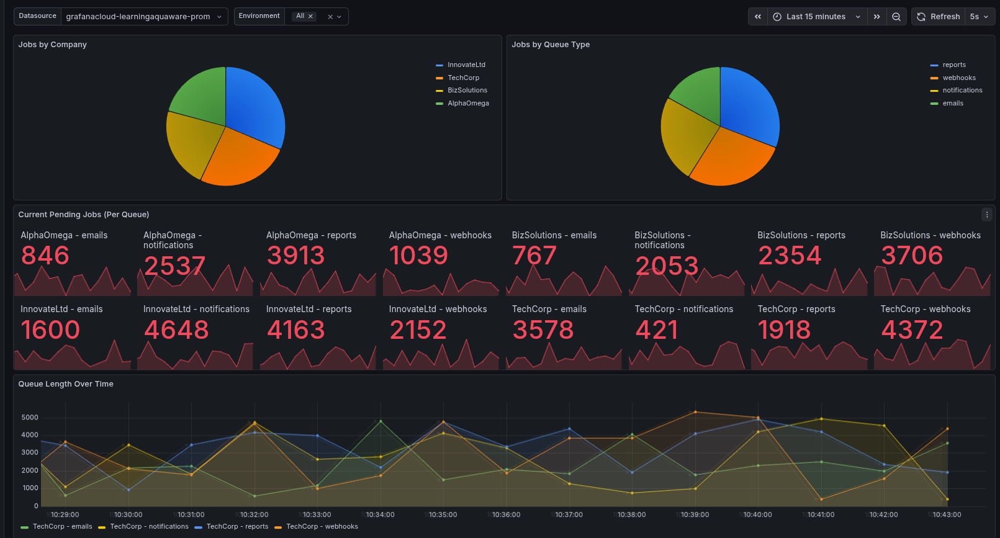
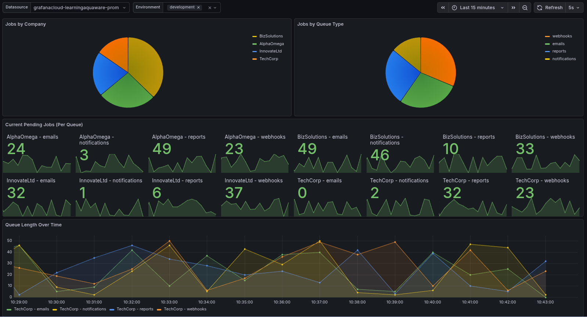
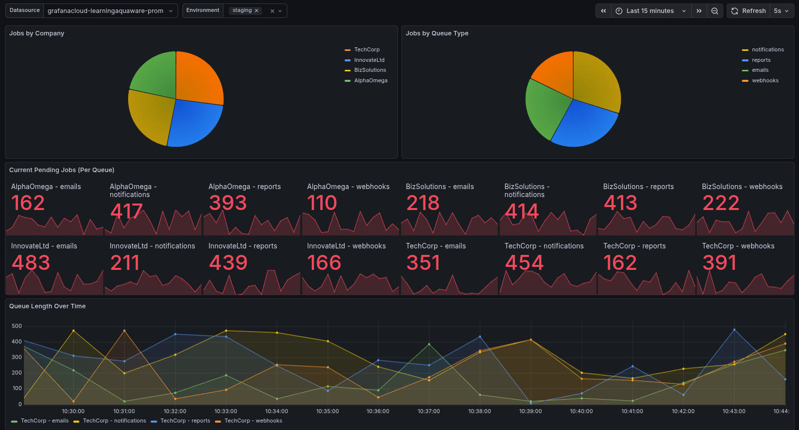

# Laravel Horizon + Grafana Cloud Observability Demo

This project demonstrates a robust observability setup for a Laravel application using Laravel Horizon, Redis, and Grafana Cloud. It showcases how to ship logs and metrics (including custom application metrics) to Grafana Cloud using the Grafana Agent.

## Features

- **Laravel Horizon**: Manages Redis queues with a beautiful dashboard.
- **Redis**: Used as the queue driver and session handler (running in Docker).
- **Grafana Agent**: A lightweight agent that ships application logs (Loki) and metrics (Prometheus) to Grafana Cloud.
- **Round-Robin Simulation**: A complex simulation of a multi-tenant queue system (Companies A, B, C...) with different queue types (High, Default, Low) across multiple environments (Development, Staging, Production).
- **Auto-Generating Metrics**: The application automatically generates simulated traffic and metrics whenever the `/metrics` endpoint is scraped by the Grafana Agent.
- **Structured Logging**: Application logs are formatted as JSON for powerful querying in Grafana Loki.
- **Ready-to-Use Dashboard**: Includes a `grafana_dashboard.json` file to instantly visualize the Round-Robin metrics.

## Prerequisites

- PHP 8.2+
- Composer
- Docker & Docker Compose
- A Grafana Cloud Account (Free tier works)
- Linux Environment (Recommended for `network_mode: "host"`)

## Installation & Setup

1.  **Clone the repository**
    ```bash
    git clone <repository-url>
    cd grafanaHorizon
    ```

2.  **Install PHP Dependencies**
    ```bash
    composer install
    ```

3.  **Environment Configuration**
    Copy the example environment file and generate the application key:
    ```bash
    cp .env.example .env
    php artisan key:generate
    ```
    
    Ensure your `.env` is configured for Redis and JSON logging:
    ```dotenv
    QUEUE_CONNECTION=redis
    LOG_CHANNEL=json
    REDIS_HOST=127.0.0.1
    ```

4.  **Grafana Agent Configuration**
    The `agent-config.yaml` file controls how data is sent to Grafana Cloud.
    
    > **Important**: This file contains secrets. Do not commit your real credentials to version control.
    
    Update `agent-config.yaml` with your Grafana Cloud credentials:
    - `YOUR_PROMETHEUS_URL` (e.g., `https://prometheus-prod-xx-xx.grafana.net/api/prom/push`)
    - `YOUR_PROMETHEUS_USER` (User ID)
    - `YOUR_PROMETHEUS_PASSWORD` (API Key / Access Policy Token)
    - `YOUR_LOKI_URL` (e.g., `https://logs-prod-xx-xx.grafana.net/loki/api/v1/push`)
    - `YOUR_LOKI_USER` (User ID)
    - `YOUR_LOKI_PASSWORD` (API Key / Access Policy Token)

## Running the Application

1.  **Start Infrastructure**
    We use Docker Compose to run Redis and the Grafana Agent.
    
    *Note: The configuration uses `network_mode: "host"` to allow the Agent to easily access the Laravel app running on the host machine. This works best on Linux.*
    
    ```bash
    docker-compose up -d
    ```

2.  **Start Laravel Development Server**
    In a new terminal window:
    ```bash
    php artisan serve
    ```
    The app will run at `http://localhost:8000`.

3.  **Start Laravel Horizon**
    In another terminal window, start the queue worker:
    ```bash
    php artisan horizon
    ```
    Access the Horizon dashboard at `http://localhost:8000/horizon`.

## How It Works

### 1. Metric Generation
The application exposes a `/metrics` endpoint. When the Grafana Agent scrapes this endpoint (every 15 seconds), the `RoundRobinMetricController` executes. 

**Crucially**, this controller does two things:
1.  **Generates Random Metrics**: It creates random values for "pending jobs" for various companies and queues.
2.  **Dispatches Real Jobs**: As a side-effect, it dispatches actual `DummyJob` instances to the Redis queue. This ensures that the Horizon dashboard also shows activity without you needing to manually trigger jobs.

### 2. Visualization
The `grafana_dashboard.json` file contains a complete dashboard definition.

**To Import the Dashboard:**
1.  Go to your Grafana Cloud instance.
2.  Click **Dashboards** -> **New** -> **Import**.
3.  Upload the `grafana_dashboard.json` file or paste its content.
4.  Select your Prometheus datasource when prompted.

## Usage & Testing Endpoints

While the system runs automatically, you can manually interact with these endpoints:

- **View Raw Metrics**: 
  `GET http://localhost:8000/metrics`
  - Triggers the simulation and returns Prometheus-formatted metrics.

- **Dispatch a Single Job**: 
  `GET http://localhost:8000/dispatch`
  - Manually queues a `ProcessJob`.

- **Simulate a Failure**: 
  `GET http://localhost:8000/fail`
  - Queues a `FailJob` that throws an exception (useful for testing error logging).

- **View Simulation Data (JSON)**:
  - `GET http://localhost:8000/metrics/rr-queue/development`
  - `GET http://localhost:8000/metrics/rr-queue/staging`
  - `GET http://localhost:8000/metrics/rr-queue/production`

## Troubleshooting

- **No Data in Grafana?**
  - Check the Grafana Agent logs: `docker logs grafana-agent`.
  - Ensure `php artisan serve` is running.
  - Verify `agent-config.yaml` has the correct credentials and URLs.
  
- **Horizon is Empty?**
  - Ensure `php artisan horizon` is running.
  - Wait for the next scrape interval (15s) or manually visit `http://localhost:8000/metrics`.

## Demo Dashboards (Public)
 - Simple: https://learningaquaware.grafana.net/public-dashboards/441fca3445e24e1e8146e379b2c26e37
 - Simple: https://learningaquaware.grafana.net/public-dashboards/46a4015d579b44fdbed97d8133cb9a35
 - Simple: https://learningaquaware.grafana.net/public-dashboards/59a1fd427cec4397bbb5fdb46bdba486
 - Composed: https://learningaquaware.grafana.net/public-dashboards/4f00977735da49809d443edce70115aa
 
## Screenshots

### All Environments


### Development Environment


### Staging Environment


